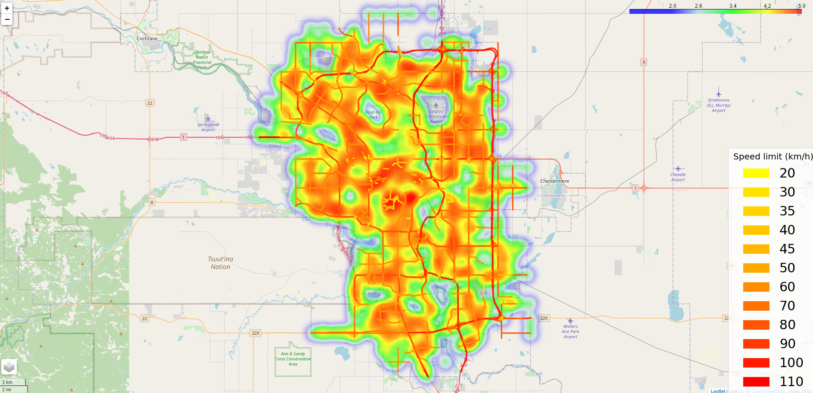
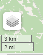

# How to use
See https://jchoi64.github.io/Calgary_Traffic_Visualization/ for Calgary's traffic data visualized in heat maps. 

 
Use the layer menu located at the bottom left to turn on/off specific layers.

 

# Generating index.html
See mapping_all.ipynb in python_files. If you are using an old version of Folium (<0.11.0), see https://github.com/python-visualization/folium/issues/1271 for fixing heat maps.

# Data
Data is provided by the City of Calgary https://data.calgary.ca/browse.

